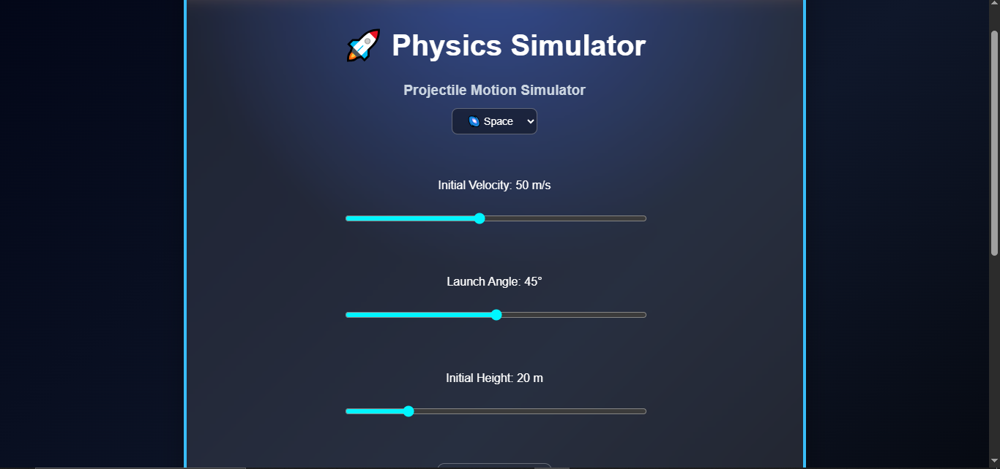

# Physics Simulator

I realized my last year's 11th grade physics class was so boring, the textbook ofc. So i decided to actually make the stuff move instead of staring at a textbook. started as a tiny projectile plot and then i was like lets add something else. now it's a dual-engine simulator that runs Projectile Motion and Simple Harmonic Motion with real-time vector math.

**try it here:** [https://poorvi230.github.io/Physics-Simulator/](https://poorvi230.github.io/Physics-Simulator/)

## screenshots

go through thewhole journey, ehh

## what it does

- **projectile motion** — sliders for velocity, angle, height. change gravity (earth/moon/space), air resistance, and crosswinds. live stats for max height, flight time, range
- **simple harmonic motion** — linear mode draws a clean displacement vs time sine wave. angular mode runs a pendulum with a full free body diagram overlay showing gravity, tension, and net restoring force vectors in real time

## the math (roughly)

the pendulum updates frame-by-frame (delta t = 0.016s) so the string stays connected to the bob:

- angular acceleration: α = -(g/L) sin(θ)
- velocity/angle: ω_new = ω_old + α·Δt, θ_new = θ_old + ω_new·Δt
- canvas position: x = x₀ + L·sin(θ)·scale, y = y₀ + L·cos(θ)·scale

## how it works

- dual-engine setup switches between projectile and SHM with isolated canvas rendering
- projectile uses real kinematic equations with configurable drag coefficients
- SHM pendulum runs euler integration per frame with a vector overlay drawn on top
- all themes and UI are custom css, no frameworks
- the projectile and shm engines each have their own js file to keep things modular

## built with

- vanilla javascript (no frameworks)
- html5 canvas api
- raw css

## ai usage

used ai to debug canvas rendering bugs and help with some of the math logic. everything else was me, including all game design and testing.
manual debugging had me humbled at sm point.

## future work

- more physics experiments (wave optics, circular motion, etc)
- cleaner ui/ux

## license

MIT
