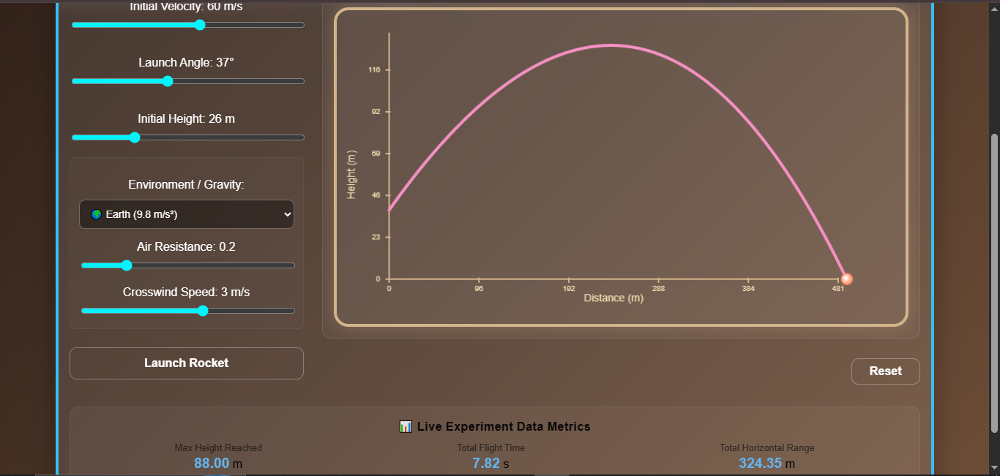
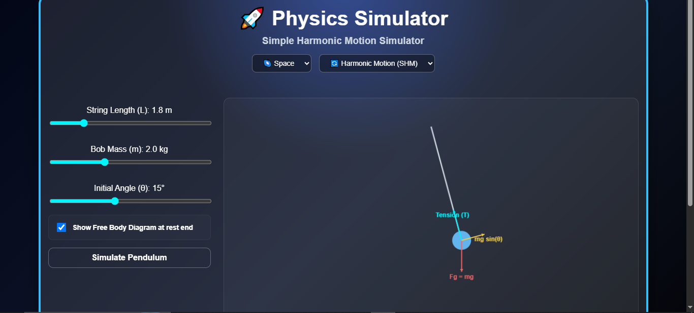
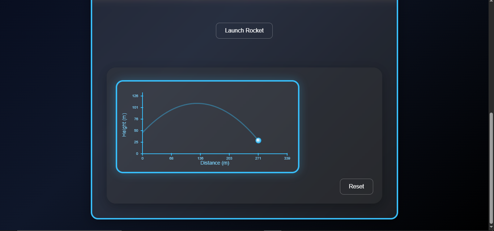
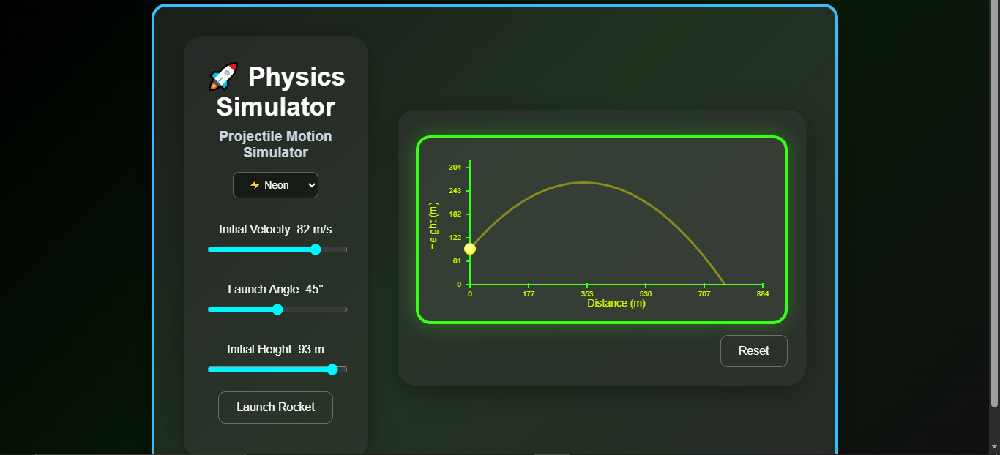
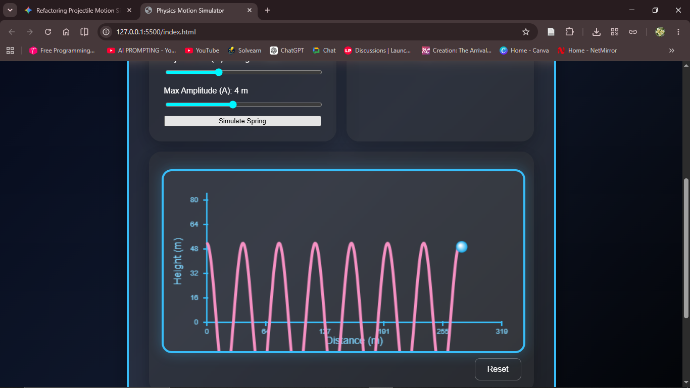
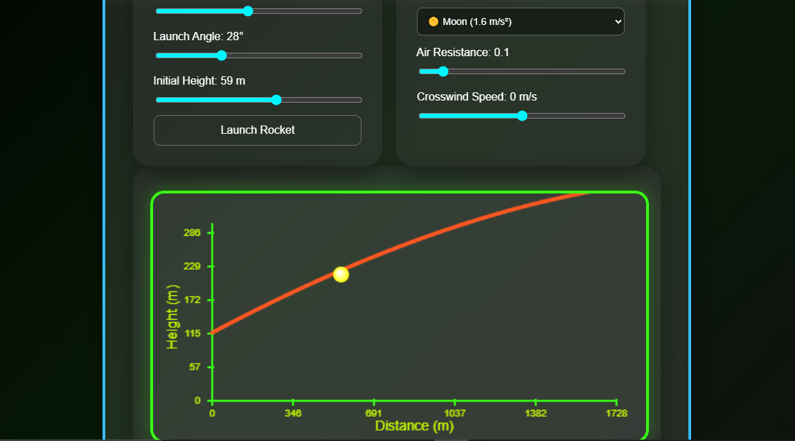

# 🚀 Physics Simulator

I built this because staring at flat, boring physics textbooks wasn't it. It started as a tiny project inspired by my 11th-standard physics class just to see a projectile actually move, but I ended up hyperfocusing and grinding for like 20+ hours on this. Now it’s a full dual-engine simulator that handles **Projectile Motion** and **Simple Harmonic Motion (SHM)** with real-time vector math.

👉 **[CHeck this out!](https://poorvi230.github.io/Physics-Simulator/)**

---

### Final Look
This is what the simulator looks like now— its fully loaded with custom gravity presets, air resistance, crosswinds, different themes, and full Free Body Diagram vector overlays.

| Final Projectile Tracker | Pendulum FBD Engine (Live Vector Arrows) |
| --- | --- |
|  |  |

### How It Started
I definitely didn't get it right on the first try. I started out with basic canvas plots before messing around with custom themes.

| Phase 1: Core Trajectory | Phase 2: Testing the Neon Theme |
| --- | --- |
|  |  |

### The Phase Where the Code Went Bonkers 
Most of my development time was spent right here trying to debug the canvas rendering engine for the SHM waves. It was going bonkers and kept drawing the old projectile coordinate lines underneath the active spring harmonic waves. Figuring out how to completely clear and isolate the canvas state took hours of trial and error.

---

## 🎨 What this simulator actually does

* Track A: Projectile Motion Engine
  * You get sliders to change the velocity, launch angle, and height whenever you want.
  * Can also change environmental stuff like gravity (Earth, Moon, Space presets), air resistance, and crosswinds.
  * It shows you live stats for max height, flight time, and the total horizontal range.

* Track B: Simple Harmonic Motion (SHM) Engine
  * **Linear Mode:** Draws a clean, isolated Displacement vs. Time sine wave graph from $-A \to +A$.
  * **Angular Mode:** A mathematically exact swinging pendulum anchored to a top-center pivot point.
  * **Free Body Diagram (FBD) Overlay:** A toggle that draws live, color-coded force vectors right on the moving bob showing **Gravity ($F_g$)**, **Tension ($T$)**, and **Net Restoring Force ($F_{\text{net}}$)**.

---

## A lil Math

The pendulum calculates real physics frame-by-frame ($\Delta t = 0.016\text{s}$) so the string actually stays attached to the bob:

1. **Angular Acceleration ($\alpha$):**
   $$\alpha = -\frac{g}{L} \sin(\theta)$$
2. **Velocity & Angle Updates:**
   $$\omega_{\text{new}} = \omega_{\text{old}} + \alpha \cdot \Delta t$$
   $$\theta_{\text{new}} = \theta_{\text{old}} + \omega_{\text{new}} \cdot \Delta t$$
3. **Canvas Position Mapping:**
   $$x_{\text{bob}} = x_0 + L \cdot \sin(\theta) \cdot \text{scaleFactor}$$
   $$y_{\text{bob}} = y_0 + L \cdot \cos(\theta) \cdot \text{scaleFactor}$$

the math is ofc important, lol.
---

## 🔮 Future Work

Future advancements are going to be-
* Adding even more physics experiments to the dashboard (like wave optics or circular motion mechanics).
* Making the UI/UX cleaner and better to use.

---

## 📝 License
This project is open-source under the [MIT License](LICENSE).
Feel free to make better versions or collaborate!!

---

Put a massive amount of effort into building this and getting the math right. Hope you like it!
